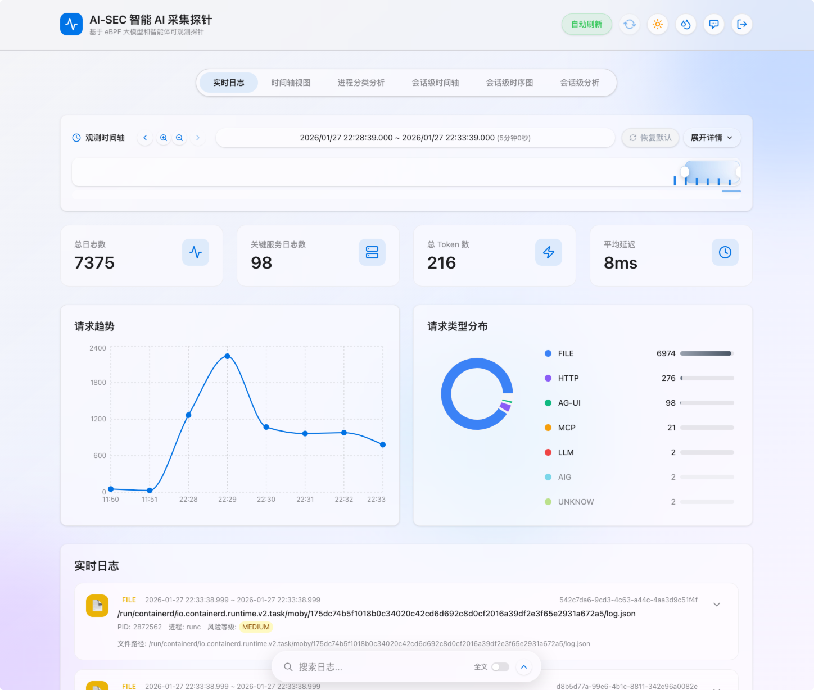
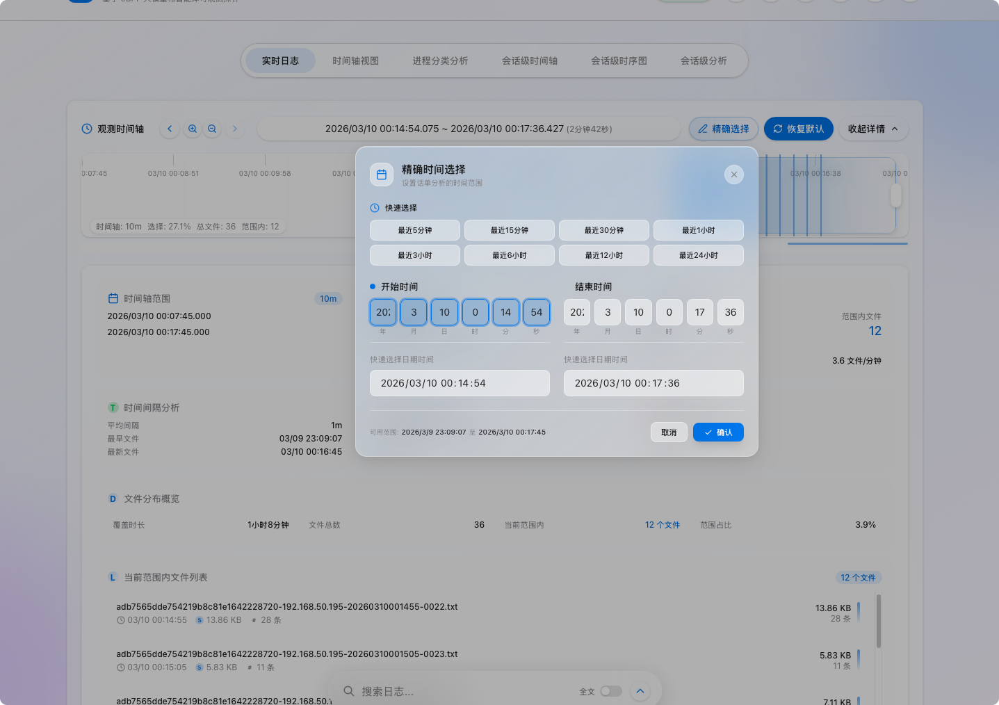
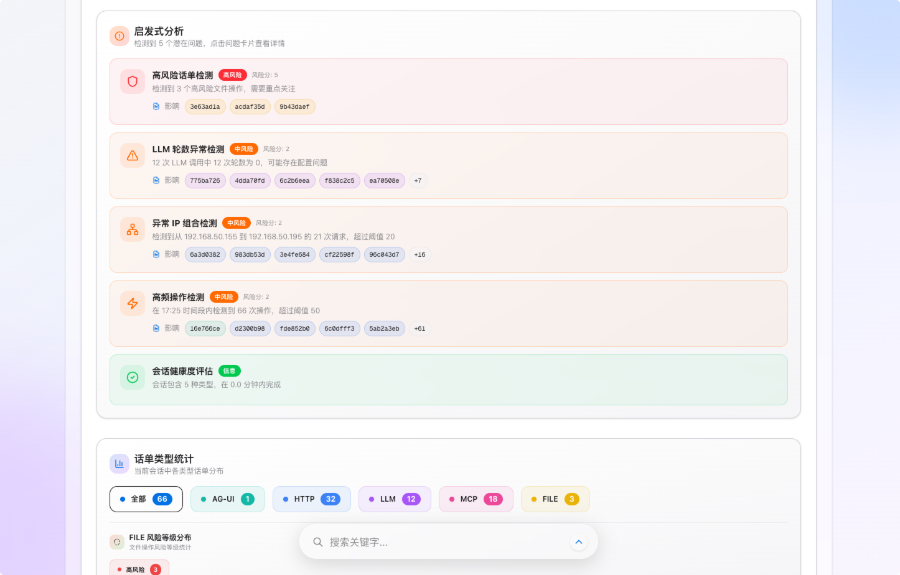
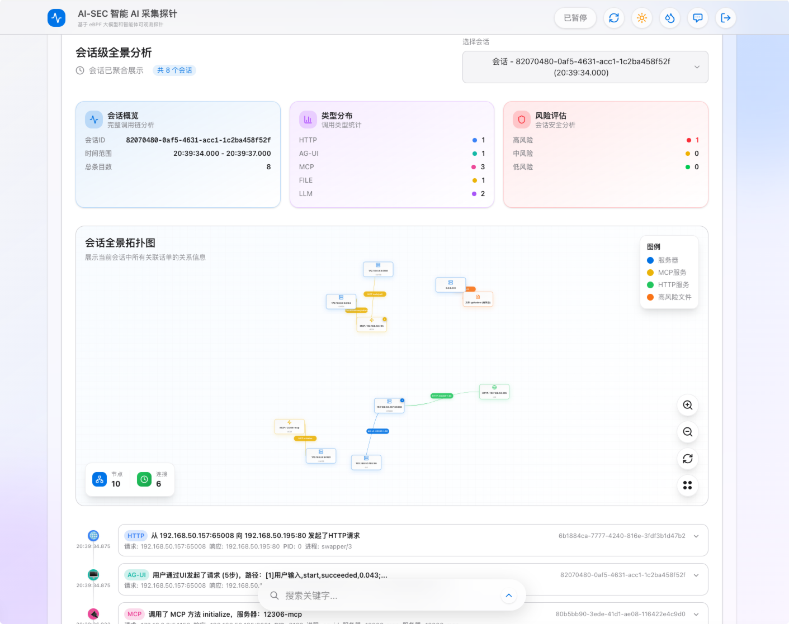
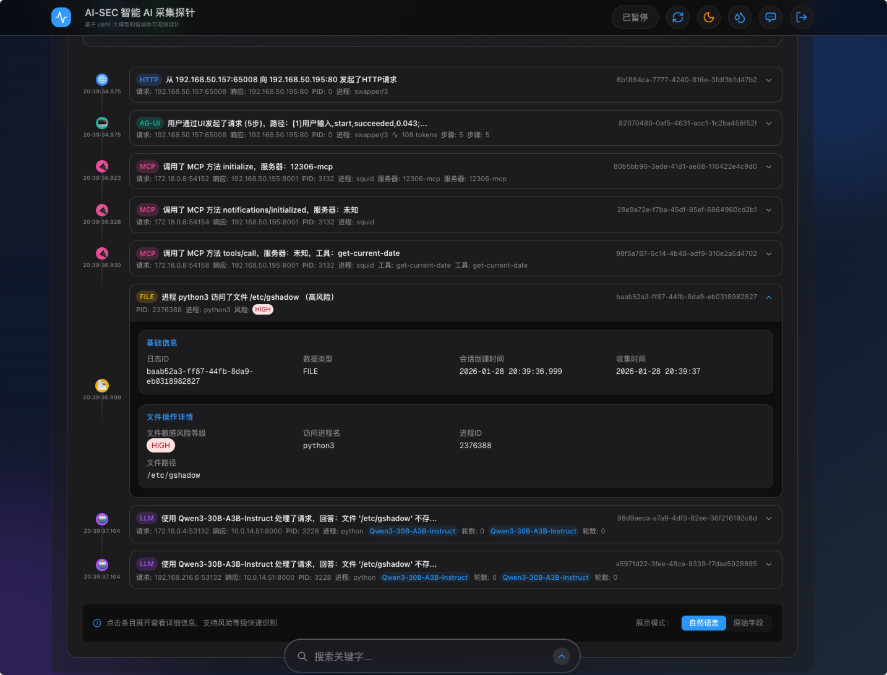
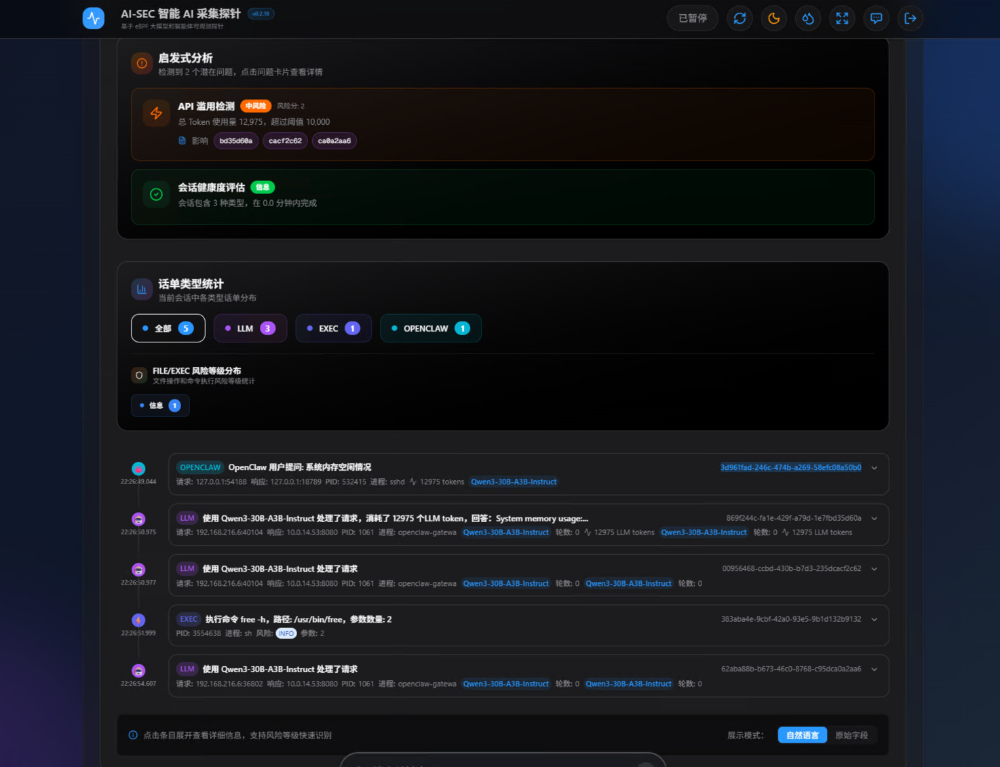

<div align="center">

# AIGov-Insight Web

**恒安嘉新大模型与智能体安全治理平台 - 可视化分析层**

[](https://www.eversec.com.cn) [](https://www.eversec.com.cn) 
[](https://github.com/Eversec-AI/AIGov-Insight-Web/stargazers) [](https://github.com/Eversec-AI/AIGov-Insight-Web/network/members) [](https://github.com/Eversec-AI/AIGov-Insight-Web/releases)
[](https://nextjs.org/) [](https://react.dev/) [](https://www.typescriptlang.org/) [](https://tailwindcss.com/) [](https://nodejs.org/)


[English](#english) | [中文文档](#中文文档)

</div>

---

## 中文文档

### 🌟 项目简介

**AIGov-Insight Web** 是恒安嘉新大模型与智能体安全治理平台（Eversec AIGov-Insight）的可视化分析层，为安全分析师提供极致丝滑、极具视觉冲击力的观测界面。

这是一套专为新一代 AI 系统（LLM / Agent / OpenClaw / MCP / RAG）量身定制的现代化可观测工具。它就像是潜伏在 AI 大脑与双手之间的"行车记录仪"，静静地放在服务器上，不改代码、不拦截流量、不依赖证书，却能把 AI 交互的每一个微小动作都完整记录并解析。

> **注意**: 本仓库仅包含 Web 可视化层。AI 智能数据采集探针参见 [AIGov-Insight Agent](https://github.com/Eversec-ai/AIGov-Insight-Agent)。

### ✨ 核心特性

#### 🔍 全息可视化
- **实时日志监控** - 实时展示 AI 交互日志，支持动态加载
- **Dashboard 多指标仪表盘** - 一览全局态势
- **会话级全景分析** - 深入分析单个会话的完整流程
- **全流程拓扑图** - 可视化展示 AI 调用链路

#### 📊 交互式分析
- **AI 观测日志时间线** - 时间轴上的事件追踪
- **会话级时序图** - 清晰展示事件因果关系
- **进程分类分级分析** - 系统级活动追踪
- **自然语言搜索** - 智能日志检索

#### 🎯 专业能力
- **OpenClaw 可观测能力** - 支持最新 AI 框架
- **系统命令执行监控** - 追踪 AI 执行的系统命令
- **多会话关联分析** - 跨会话事件关联
- **全文搜索 + Dark Mode** - 现代化用户体验

### 📸 功能截图

| 实时日志 + Dashboard 多指标仪表盘 | 交互式AI观测日志时间线 + 高效动态话单加载 |
|:---:|:---:|
|  |  |

| 会话级多维度启发式分析 | 会话级全景分析 + 全流程拓扑图 |
|:---:|:---:|
|  |  |

| 会话流程分析 + 自然语言 | OpenClaw 会话级关联分析 |
|:---:|:---:|
|  |  |


### 🚀 快速开始

#### 前置要求

- x86_64 架构
- Ubuntu 22.04 LTS
- Node.js 20+ 
- npm 或 yarn 包管理器

#### 安装与运行

```bash
# 克隆仓库
git clone https://github.com/eversec/AIGov-Insight-web.git
cd AIGov-Insight-web

# 安装依赖
npm install --legacy-peer-deps

# 开发模式
npm run dev

# 生产模式
npm run build
npm run start

# standalone 模式
./build-package.sh -v 0.2.20 
cd dist/ && ./start.sh --debug -d /var/log/ai-sec-agent/data/

```

访问 [http://localhost:3000](http://localhost:3000) 查看应用。


### 🛠️ 技术栈

- **框架**: [Next.js 16](https://nextjs.org/) - React 全栈框架
- **UI**: [React 19](https://react.dev/) + [Tailwind CSS 4](https://tailwindcss.com/)
- **动画**: [Framer Motion](https://www.framer.com/motion/)
- **图表**: [Recharts](https://recharts.org/)
- **图标**: [Lucide React](https://lucide.dev/)
- **认证**: [NextAuth.js](https://next-auth.js.org/)
- **语言**: [TypeScript](https://www.typescriptlang.org/)

### 📁 项目结构

```
├── src/
│   ├── app/              # Next.js App Router
│   │   ├── api/          # API 路由
│   │   ├── auth/         # 认证页面
│   │   └── page.tsx      # 主页面
│   ├── components/       # React 组件
│   │   ├── Dashboard.tsx
│   │   ├── TimelineView.tsx
│   │   ├── TopologyGraph.tsx
│   │   └── ...
│   ├── lib/              # 工具函数
│   ├── hooks/            # 自定义 Hooks
│   ├── context/          # React Context
│   └── types/            # TypeScript 类型
├── public/               # 静态资源
└── package.json          # 项目配置
```

### 🤝 贡献

我们欢迎所有形式的贡献！请阅读 [贡献指南](./CONTRIBUTING.md) 了解如何参与项目开发。

### 📄 许可证

本仓库遵循 [LICENSE](./LICENSE) 开源协议，该许可证本质上是 Apache 2.0，但有一些额外的限制。

### 🙏 致谢

感谢所有为这个项目做出贡献的开发者！

---

## English

### 🌟 Overview

**AIGov-Insight Web** is the visualization and analysis layer of Eversec AIGov-Insight, the world's first LLM & Agent security governance platform. It provides security analysts with a smooth, visually stunning observation interface.

This is a modern observability tool tailored for next-generation AI systems (LLM / Agent / RAG / MCP / OpenClaw). It acts like a "dashcam" placed between the AI's brain and hands - sitting quietly on the server, without modifying code, intercepting traffic, or relying on certificates, yet capturing and parsing every tiny action of AI interactions.

> **Note**: This repository only contains the Web visualization layer. The data collection probe see [AIGov-Insight Agent](https://github.com/Eversec-ai/AIGov-Insight-Agent)

### ✨ Key Features

- **Real-time Log Monitoring** - Real-time display of AI interaction logs
- **Dashboard Multi-metric Dashboard** - Overview of global security posture
- **Session-level Panoramic Analysis** - Deep analysis of complete session flows
- **Full-process Topology Graph** - Visualize AI call chains
- **Interactive Timeline** - Event tracking on timeline
- **Process Classification Analysis** - System-level activity tracking
- **OpenClaw Observability** - Support for latest AI frameworks
- **Dark Mode** - Modern user experience

### 🚀 Quick Start

```bash
# Clone the repository
git clone https://github.com/eversec/AIGov-Insight-web.git
cd AIGov-Insight-web

# Install dependencies
npm install --legacy-peer-deps

# Development mode
npm run dev

# Production mode
npm run build
npm run start

# standalone mode
./build-package.sh -v 0.2.20 
cd dist/ && ./start.sh --debug -d /var/log/ai-sec-agent/data/
```

Visit [http://localhost:3000](http://localhost:3000) to view the application.

### 📄 License

This repository is licensed under the [LICENSE](./LICENSE), based on Apache 2.0 with additional conditions.

---

<div align="center">

**[⬆ Back to Top](#AIGov-Insight-web)**

Made with ❤️ by [Eversec.ai (恒安嘉新)](https://www.eversec.com.cn/)

</div>
